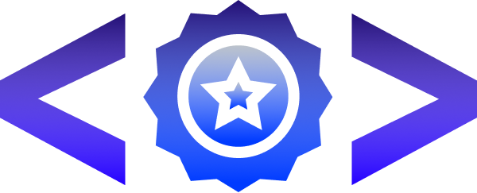

<p align="center">
  
</p>

<h1 align="center">
    
</h1>

<br>

## Tecnologias

Esse projeto foi desenvolvido com as seguintes tecnologias:

- [React](https://reactjs.org)
- [Scss](https://sass-lang.com/)
- [TypeScript](https://www.typescriptlang.org/)

## Como executar

Clone o projeto e acesse a pasta do mesmo.

```bash
$ git clone https://github.com/Preparatorio-Olimpico-Numisma/FrontEnd.git
$ cd numisma
```

Para rodar em sua máquina rode:
```bash
# Para instalar as dependências. 
$ yarn
```

```bash
# Para iniciar o projeto
$ yarn start
```
O app estará disponível no seu browser pelo endereço [http://localhost:3000](http://localhost:3000).

## Projeto
O Numisma é uma empresa que tem foco em preparar pessoas para olimíadas cíenticas.
